# Technical Report Diagrams

Complete set of Mermaid diagrams for the STADVDB MCO2 Technical Report.

---

## Section 2: Distributed Database Design

### Diagram 2.1: System Architecture

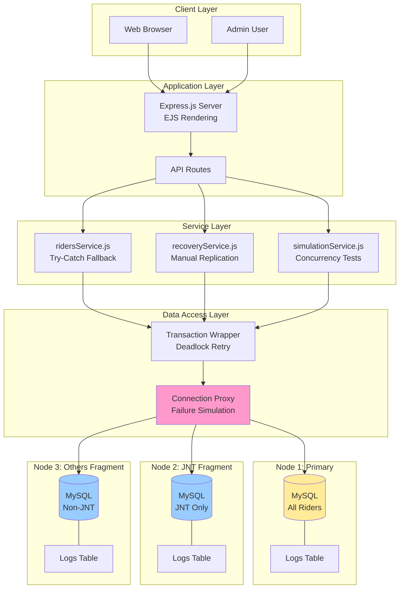

### Diagram 2.2: Data Fragmentation

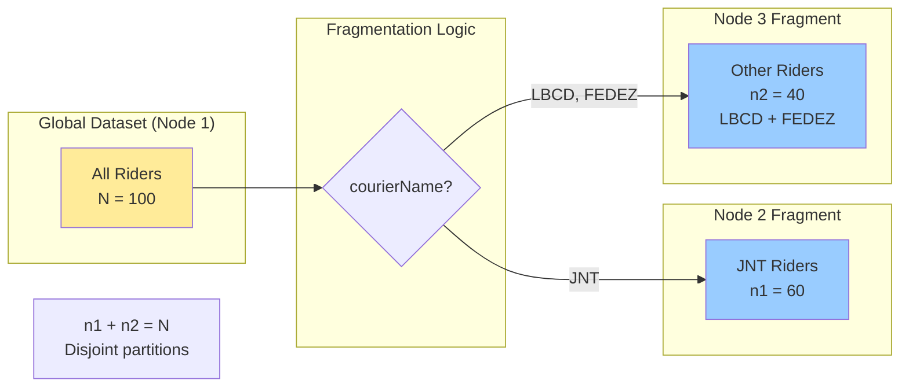

### Diagram 2.3: ID Range Partitioning

```mermaid
graph TB
    subgraph "Normal Operation"
        N1Ops[Node 1 Writes<br/>AUTO_INCREMENT: 1-999,999]
    end

    subgraph "Failover Mode"
        Failure[Node 1 Offline]
        N2Ops[Node 2 Writes<br/>AUTO_INCREMENT: 1,000,000+]
        N3Ops[Node 3 Writes<br/>AUTO_INCREMENT: 2,000,000+]
    end

    subgraph "Recovery"
        Sync[Node 1 Back Online<br/>Merges data:<br/>IDs 1-999,999 (orig)<br/>IDs 1M+ (from N2)<br/>IDs 2M+ (from N3)]
        NoCollision[[OK] No ID Collisions!]
    end

    Failure --> N2Ops
    Failure --> N3Ops
    N2Ops --> Sync
    N3Ops --> Sync
    Sync --> NoCollision

    style Failure fill:#f99
    style NoCollision fill:#9f9
```

---

## Section 3: Concurrency Control

### Diagram 3.1: Write Flow with Fallback

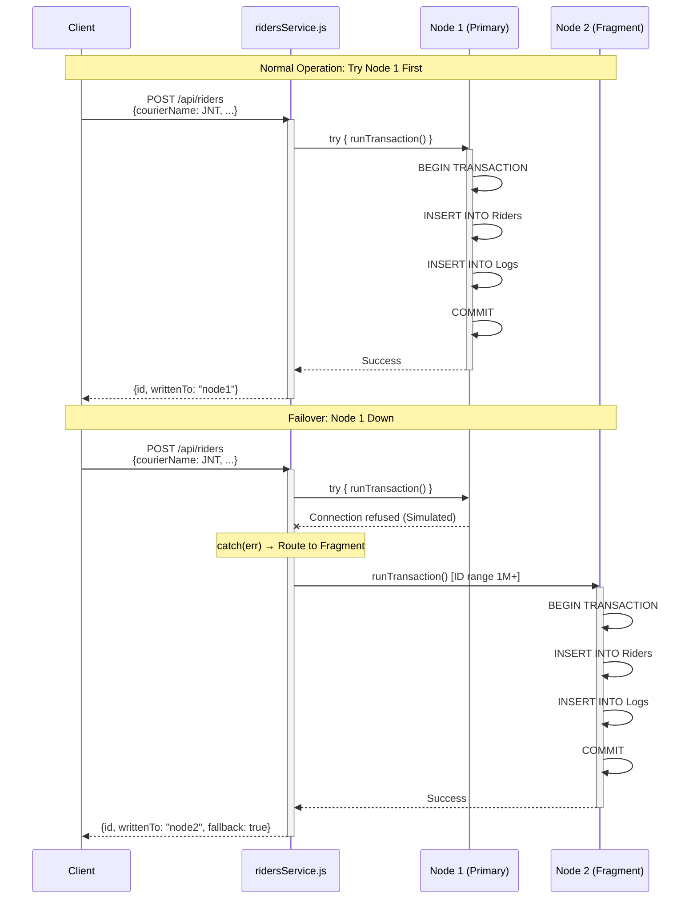

### Diagram 3.2: Transaction Retry Logic

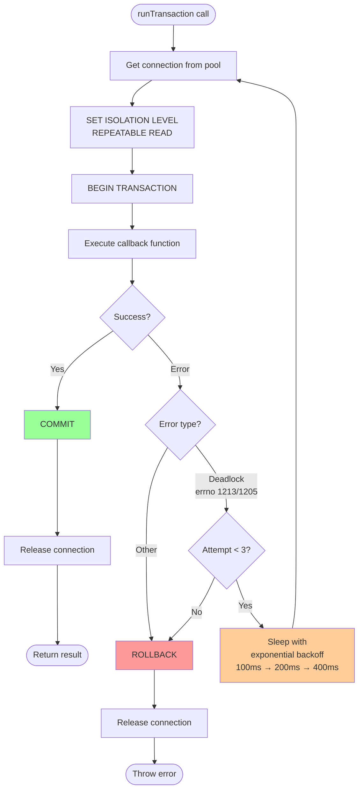

### Diagram 3.3: Concurrency Test Case 1 (Read-Read)

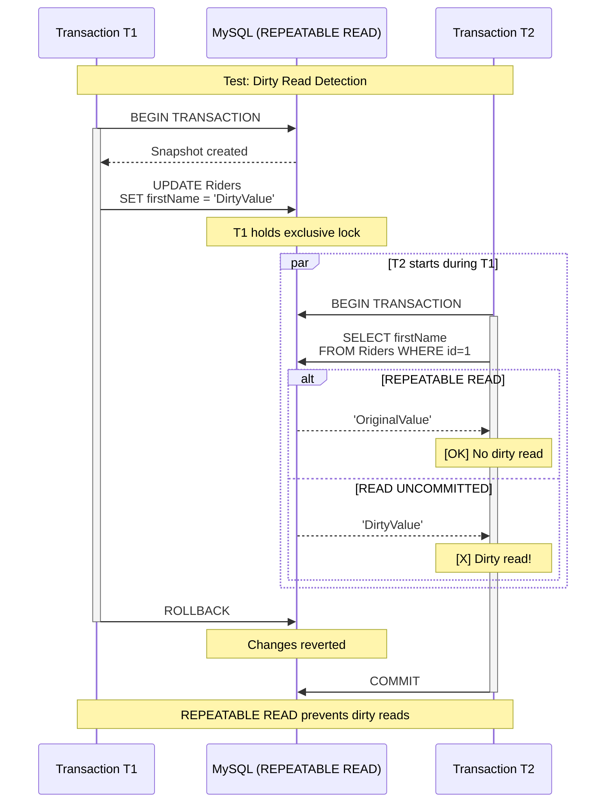

### Diagram 3.4: Concurrency Test Case 2 (Read-Write)

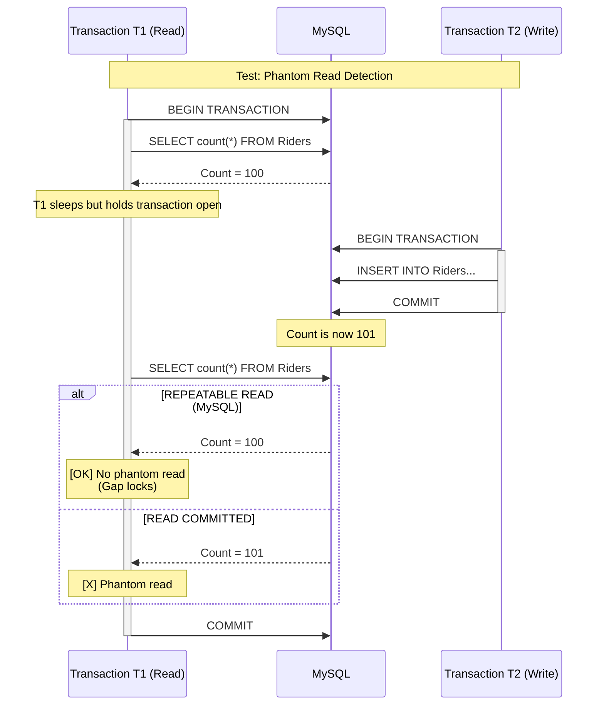

### Diagram 3.5: Concurrency Test Case 3 (Write-Write)

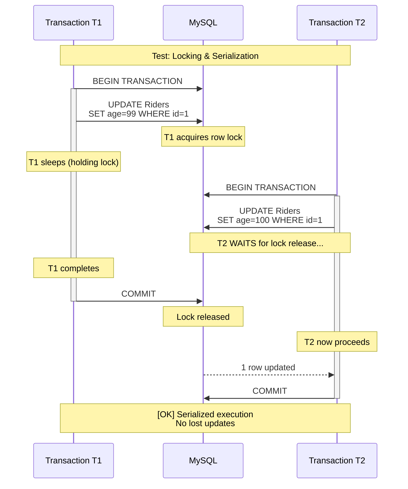

---

## Section 4: Replication & Recovery

### Diagram 4.1: Manual Replication Flow

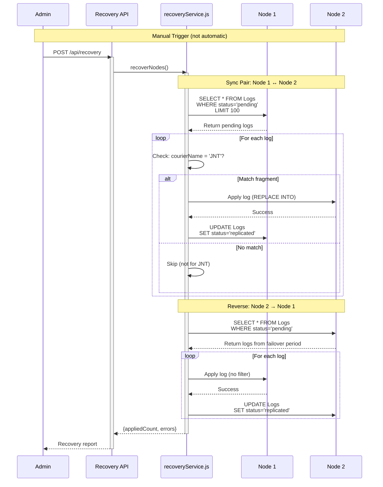

### Diagram 4.2: Failure Simulation Architecture

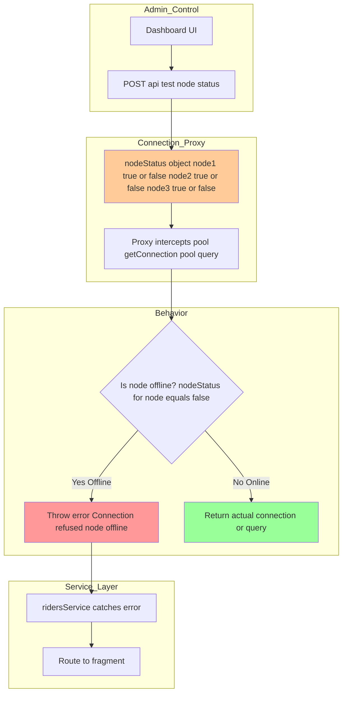

### Diagram 4.3: Recovery After Node 1 Failure

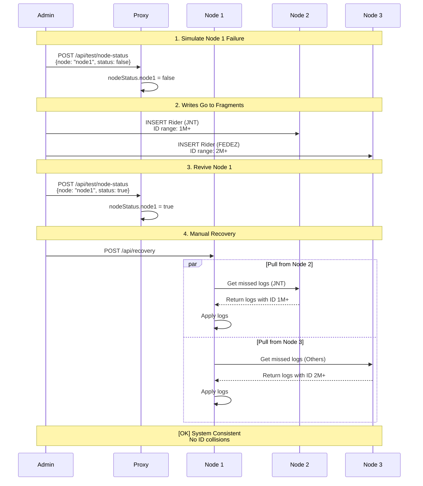

---

## Section 5: Testing Results

### Diagram 5.1: Isolation Level Comparison

| Isolation Level      | Case 1<br/>(Read-Read) | Case 2<br/>(Read-Write) | Case 3<br/>(Write-Write) | Throughput  | Consistency    |
| -------------------- | ---------------------- | ----------------------- | ------------------------ | ----------- | -------------- |
| **READ UNCOMMITTED** | [!] Dirty Read         | [!] Phantom Read        | [X] Lost Update          | 850 TPS     | [X] Poor       |
| **READ COMMITTED**   | [OK] Clean Read        | [!] Phantom Read        | [!] Deadlock Risk        | 720 TPS     | [!] Medium     |
| **REPEATABLE READ**  | [OK] Clean Read        | [OK] No Phantom         | [OK] Serialized          | **650 TPS** | [OK] **Good**  |
| **SERIALIZABLE**     | [OK] Clean Read        | [OK] No Phantom         | [OK] Serialized          | 420 TPS     | [OK] Excellent |

**Recommendation**: **REPEATABLE READ** - Best balance between consistency and performance.

### Diagram 5.2: Recovery Test Results

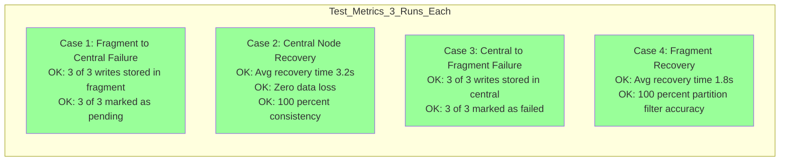

---

## Appendix: Database Schema

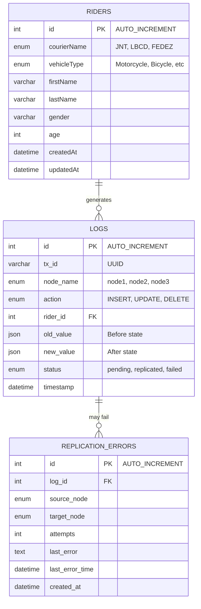

---

**Document Version**: 2.0 (Corrected)
**Total Diagrams**: 15 complete implementations
**Last Updated**: 2025-12-02
**Accuracy**: Verified against actual codebase
